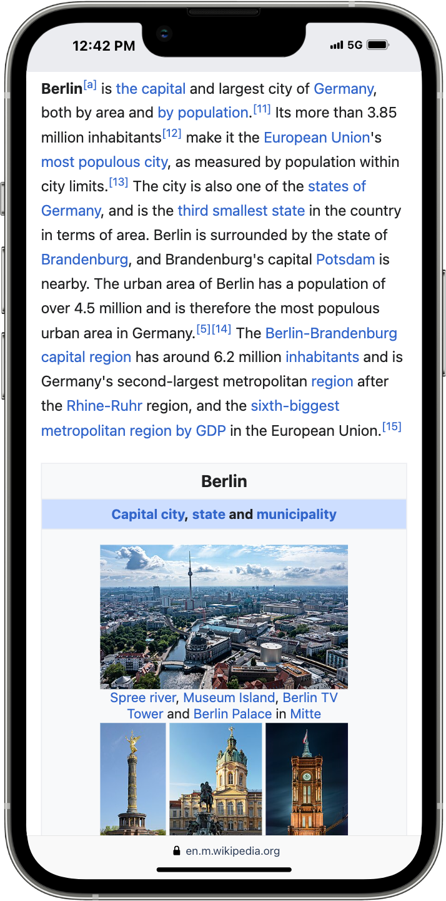

Assessing the performance of a software system is essential for developers and application builders. Whether creating a simple web app or a complex social network, it's crucial to measure content quality, user experience, and long-term value of the features that you build.

Historically, evaluation methods have ranged from simple engagement metrics to human-based assessments and complex econometric models. However, the rise of Large Language Models (LLMs) has introduced a novel approach: LLM-as-a-judge.

LLM-as-a-judge takes advantage of LLMs varasitilty to provide easy evaluation. By defining specific evaluation criteria and providing data, LLMs can offer comprehensive assessments, including verdicts, explanations, and improvement suggestions. This unified approach simplifies the evaluation process, making it easier to identify strengths, weaknesses, and potential areas for optimization. This new approach while not a selver bullet, it could be a greate addition to software evaluation tools you can use of your projects.

### Example of LLM-as-a-judge
Let us take a simple example, imagine we are developing an app to help people learn about places they want to visit. Lets say a user lands on a page talking about specific city, like Berlin. We can start from exploring exisitng options like Wikipedia, bing and google search as shown in the table below. You can already observe, due to limited page realestate, UX provided by google and bing provide the user with more leads for further reading and allow interactivty to some degree. In such chase, you don't even need an A/B test to tell that wikipeida is not the right way to go!

<style>
.responsive-table {
  width: 100%;
}

.responsive-table td {
  display: block;
  text-align: center;
}

.responsive-table img {
  max-width: 100%;
  height: auto;
}
</style>

<table>
  <tr>
    <td></td>
    <td></td>
    <td></td>
  </tr>
</table>

Now, that we say how it looks like, lets revert to LLM-as-a-judge and see how it goes. I will use the following promopt and call 


```text
You are an AI agent who judge UX, your task is to select the best UX for an app used for exploring places to visit. You will be provided with multiple screenshots and your task is to evaluate which one is the best UX. 

Pleas think step-by-step and provide exntinsive evaluation of the screenshots, focus on the ability of users to learn about places to visit and get the right information for thier forthcomming trip. 

Answr in a tabular formate.```


Input Data:

Screen shot 1:
image_1.png

Screen shot 2:
image_2.png

Screen shot 3:
image_3.png

Answer:
```

| Criteria | Screenshot 1 | Screenshot 2 | Screenshot 3 |
|---|---|---|---|
Clarity and conciseness | Information is clear and concise, but the overall presentation is basic. | Information is clear and concise, with a more engaging layout. | Information is clear and concise, similar to Screenshot 2. |
Relevance |	Provides a relevant overview of Berlin as a city, including population and notable landmarks. | Provides a relevant overview of Berlin, with a focus on visual appeal. | Provides a relevant overview of Berlin, similar to Screenshot 2. |
Navigation | N/A (single-page screenshot) | Basic navigation structure with a clear header and footer. | Basic navigation structure with a clear header and footer. |
Visual appeal |	Simple and functional, but lacks visual interest. |	Engaging design with a large hero image and weather information. |	Similar to Screenshot 2, with a focus on visual appeal. |
Overall evaluation | A good starting point, but lacks visual appeal and navigation. | Offers a more engaging experience with a focus on visual appeal and basic information. | Similar to Screenshot 2, but could benefit from more detailed information about specific places to visit. |

```text
Final Verdict: Screenshot 2 offers the best overall UX due to its engaging design and relevant information. However, all three screenshots could benefit from improved navigation and more detailed information about specific places to visit.
```

As you can see, the LLM judge provides good explanations and detailed evaluation based on the background knowladge it gain from the webscale training data. Now that we got the teaser, lets talk about some cool use-cases for using this evaluation methodology.


### LLM-as-a-judge for UX experimentatation
#### Accelerate innovation with subjective metrics 
Now, let's imagine you're working on a travel suggestions app. You're considering two new features: adding a search bar or implementing filters for specific interests like "sightseeing" or "nature." Traditionally, you'd build both, run an A/B test, and see which performs better based on metrics like time spent, conversions (saving a place), or revenue.

However, this standard approach is costly and time-consuming. Developing both features requires significant resources, and achieving statistically significant results often demands a large user base. Even if your A/B test shows a positive impact on metrics like revenue or conversions, it doesn't reveal the full picture. You're left in the dark about the long-term effects - will this change lead to user fatigue or churn down the line? And crucially, you won't understand why one feature outperformed the other, hindering your ability to learn and iterate effectively.

This is where LLMs can offer a valuable alternative. They can assess "surrogate features" - metrics closely aligned with your business goals, but often subjective and difficult to measure in traditional A/B tests. These surrogate features, like "ease of discovery" or "relevance of results," are often closer to your core value proposition and better predictors of long-term success than typical behavioral or monetary metrics. Moreover, LLMs can provide these insights without needing a large sample size, making them a powerful tool for early-stage feature evaluation and iteration.

 This would allows to define a utility function like this:

  $Utility = Ease of Discovery * Repeated Sessions * Value of Discovery$

Instead of building both a search bar and filters, you can leverage an LLM to assess  based on key metrics. For instance, the LLM can evaluate 1000 screenshots with various inputs and compare the new features (treatments) against the existing interface (control) to generate a win/tie/loss ratio.

| Feature | Ease of Discovery (Win/Tie/Loss) | Repeated Sessions (Win/Tie/Loss) | Value of Discovery (Win/Tie/Loss) |
|---|---|---|---|
Search Bar |	50%/30%/20%	| 40%/20%/40%	| 65%/25%/10%
Filters |	70%/20%/10%	| 30%/30%/40%	| 50%/30%/20%

This breakdown highlights the strengths and weaknesses of each feature. Filters excel in making it easy for users to find what they're looking for, while the search bar is better in helping users discover unique and valuable travel options. Both features have a comparable impact on encouraging repeat visits.

If your primary goal is to make it incredibly easy for users to find relevant travel options, the filters seem like the stronger contender. However, if you're more focused on helping users discover hidden gems and unique experiences they'll truly value, the search bar might be the better choice.

While you wouldn't completely rely on an LLM judge for your business decisions, this approach offers remarkable advantages: it's developer-friendly, highlighting the pros and cons of different features and providing insights into key subjective metrics. It's also incredibly cost-effective, generating valuable data points even with a modest budget, eliminating the need for months of development just to try out an idea with a real A/B test.

##### Dynamic evaluation criteria: Adapting to Diverse User Needs and Contexts

One size rarely fits all, especially when it comes to user experiences. User expectations and needs vary wildly depending on the specific context, and successful software must cater to this diversity. Consider our travel app example: a user planning a trip to Iceland will likely prioritize information about natural landscapes and outdoor activities, while someone heading to New York might be more interested in cultural attractions and urban experiences. Evaluating these vastly different scenarios requires an equally adaptable approach.
Dynamic evaluation criteria address this need by enabling the LLM-as-a-judge to tailor its assessments based on the specific context and input data. In our travel app example, this means recognizing that a page optimized for Iceland should emphasize different elements than one designed for New York. The LLM can draw upon its vast training data and knowledge base to understand these nuances, providing valuable insights into what users might find relevant and engaging in each specific context.
By incorporating dynamic evaluation criteria, we empower LLM-as-a-judge systems to go beyond simple comparisons and offer contextually relevant evaluations that truly reflect the diverse needs of users.

Prompt Examples showcasing Dynamic Evaluation Criteria:
Scenario 1: Travel app page about Iceland
Prompt:

```text
You are an AI agent evaluating the user experience (UX) of travel app pages. Given a screenshot, assess its UX based on the context of a user planning a trip to Iceland.

**Key considerations:**

* Highlight information about natural landscapes, outdoor activities, and weather conditions.
* Prioritize stunning visuals of Iceland's scenery.
* Include practical information like local tours, transportation options, and safety tips for outdoor adventures. 

**Evaluate the following screenshot:**

[Insert Screenshot of Travel App Page about Iceland]
```

Scenario 2: Travel app page about New York City
Prompt:

```text
You are an AI agent evaluating the user experience (UX) of travel app pages. Given a screenshot, assess its UX based on the context of a user planning a trip to New York City.

**Key considerations:**

* Focus on showcasing iconic landmarks, cultural attractions, and diverse neighborhoods.
* Emphasize information on transportation options, restaurant recommendations, and nightlife suggestions.
* Highlight curated itineraries for different interests (e.g., art lovers, foodies, history buffs).

**Evaluate the following screenshot:**

[Insert Screenshot of Travel App Page about New York City]
```

By providing these context-specific prompts, we guide the LLM-as-a-judge to evaluate each page based on the unique needs and expectations of its intended audience, ensuring a more relevant and accurate assessment.


#### Iterate offline, verify using A/B test


#### Build gurdrails and large scale automated tests


Main point: before going into AB test, create features with LLM-as-a-judge, then fit a model.


----------
#### LLMs self improve 

#### Combine with synthetic data generation


#### Skill evaluation (human out of teh loop)

#### Skill evaluation (human out of teh loop)


### Can we use LLM-as-a-judge for evaluting machine learing and LLM systems?

The idea of an LLM serving as a judge is controversial. At first glance, it seems counterintuitive: if an LLM could recognize its own shortcomings, wouldn't it strive to rectify them? However, a deeper dive into the nature of intelligence reveals a fundamental asymmetry that makes this proposition plausible.

The Asymmetry of Intelligence

Intelligence, both human and artificial, exhibits a significant asymmetry between generative and discriminative capabilities. This means that entities can often comprehend and evaluate complex information more effectively than they can produce it. A simple analogy is the appreciation of art versus its creation. While many people can appreciate the intricacies of a masterpiece like "The Lord of the Rings," far fewer possess the creative talent to produce such a work.

LLMs and the Discriminative-Generative Gap

LLMs exemplify this asymmetry. They are adept at understanding and evaluating text, identifying patterns, and making informed judgments. This discriminative ability allows them to distinguish between good and bad arguments, correct information from misinformation, and even detect biases. However, their generative capabilities, while impressive, are often limited. They may struggle to produce truly original or nuanced content, especially when faced with complex or unfamiliar tasks.

Real-World Examples of the Asymmetry

This asymmetry is evident in various aspects of human and machine intelligence:

- Algorithm Optimization: Algorithms can be designed to optimize solutions to specific problems, but verifying the correctness of those solutions often requires different skills and techniques.
- Scientific Research: Scientists can evaluate the validity of experimental results and theories, but generating groundbreaking discoveries often involves a combination of creativity, intuition, and serendipity.
- Human Relationships: We can understand and respond to the emotions of others, but expressing our own feelings in a meaningful and authentic way can be challenging.

The Implications for LLMs as Judges

The discriminative-generative asymmetry suggests that LLMs, while not perfect, can be effective tools for legal decision-making. Their ability to understand and evaluate arguments, identify biases, and apply relevant laws makes them well-suited to the role of a judge. However, it is crucial to recognize the limitations of LLMs and ensure that they are used in conjunction with human oversight to prevent unintended consequences and ensure fairness.


### How to evaluate LLM-as-a-judge

why does it work ? 

why it is useful?


Taxonomy of skills to evaluate


Evaluation methods: 


Putting human in the loop

Pulling humna from the loop 

